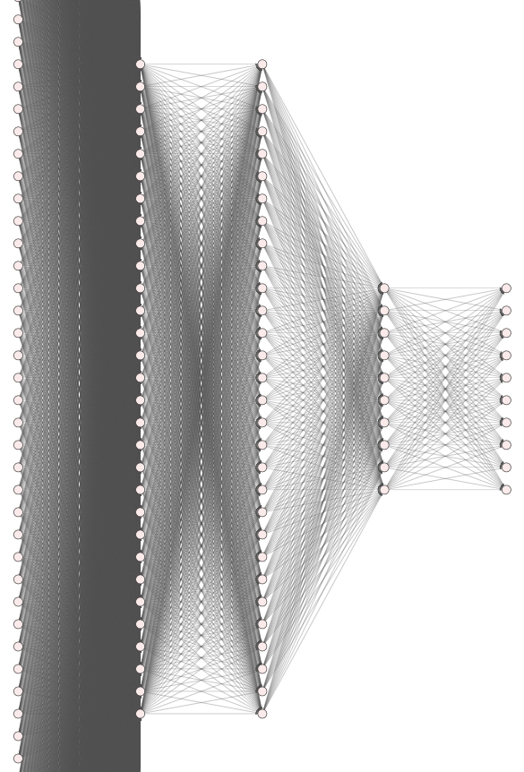
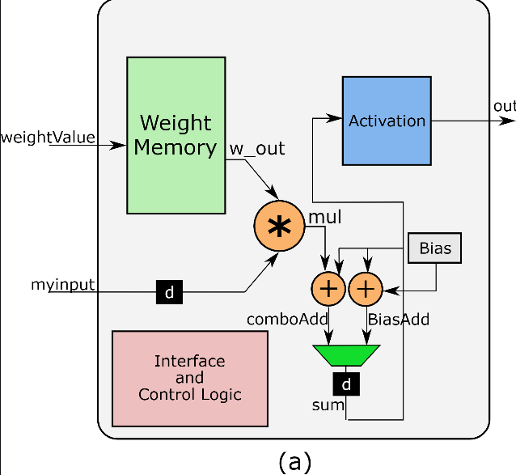

# DigitRecognizerANN
IMPLEMENTATION OF HANDWRITTEN DIGITS USING FULLY CONNECTED ANN
---

# Detecting Handwritten Digits Using a Fully Connected Artificial Neural Network in FPGA

  

## Overview

This project implements a **5-layer fully connected Artificial Neural Network (ANN)** on an FPGA to recognize handwritten digits from the MNIST dataset. The goal is to leverage the advantages of FPGAs, such as low power consumption and minimal latency, making them a viable alternative to GPUs for AI/ML applications.

### Key Features

- **Accuracy:** Achieved 98% accuracy using a fully connected ANN.
- **Efficiency:** Lower power consumption and memory usage compared to traditional GPUs.
- **Scalability:** Flexible architecture capable of adapting to various input sizes and datasets.
- **Hardware Utilized:** Vivado 2022.1 and Zynq 7000 board.

## Table of Contents

1. [Introduction](#introduction)
2. [Project Architecture](#project-architecture)
3. [Methodology](#methodology)
4. [Results and Comparison](#results-and-comparison)
5. [Conclusion](#conclusion)
6. [References](#references)

## Introduction

Artificial Neural Networks (ANNs) are proving to be a powerful tool in AI/ML, particularly when implemented in FPGAs. This project explores the feasibility of replacing GPUs with FPGAs for digit recognition tasks. The FPGA implementation demonstrates superior memory and power efficiency while maintaining high accuracy, making it ideal for low-latency applications.

## Project Architecture

The project implements a fully connected, feed-forward ANN with 5 layers:
- **Input Layer:** 784 inputs (28x28 pixels)
- **Hidden Layers:** Three hidden layers with 30, 30, and 10 neurons respectively.
- **Output Layer:** 10 neurons corresponding to the digits 0-9.

### Block Diagram of the Neuron

  

The basic operation of a neuron involves a weighted sum of inputs followed by an activation function. This project implements both Sigmoid and ReLU as activation functions.

## Methodology

### Neuron Implementation

Each neuron is implemented using Verilog, with weights and biases pre-trained in Python. The binary files for weights and biases are loaded into the FPGA during execution. The neuron processes inputs using fixed-point arithmetic, ensuring efficient hardware utilization.

### Activation Functions

- **Sigmoid:** Ideal for smal
